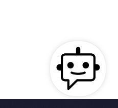
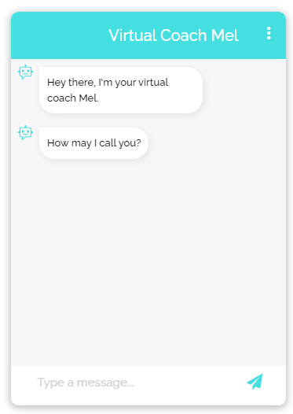
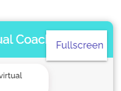

# virtual_coach_useful_activities
Virtual coach that proposes preparatory activities for quitting smoking and becoming more physically active.

Based on this Github repository (https://github.com/AmirStudy/Rasa_Deployment) as well as the work by Tom Jacobs (https://github.com/TomJ-EU/rasa/tree/dev).

## Components

This virtual coach consists of a backend based on Rasa Open Source (backend), a custom action server (actions), a frontend (frontend), a database (db), and an SQLTrackerStore.

## Setup on Google Compute Engine

To run this project on a Google Compute Engine, I followed these steps:

   - Create a Google Compute Engine instance:
	  - Use Ubuntu 20.04.
	  - Make sure that the location is in Europe.
	  - Enable http and https traffic.
	  - Choose a small instance for the start, since you have to pay more for larger instances. I started with an e2-medium machine type and 100GB for the boot disk.
	  - The first 3 months you have some free credit.
      - Follow the instructions from [here](https://github.com/AmirStudy/Rasa_Deployment) in the sense that you “allow full access to all cloud APIs” on the Google Compute Engine instance. This is shown in this video: https://www.youtube.com/watch?v=qOHszxJsuGs&ab_channel=JiteshGaikwad. Also see this screenshot:
   
      
   
   - Open port 5005 for tcp on the Compute Engine instance:
	
   
	
   
	
   
	
   
   
   
	
   - Follow the instructions from [here](https://github.com/AmirStudy/Rasa_Deployment) for installing Docker on the Google Compute Engine instance. You can do this via the command line that opens after you click on "SSH":
   
   
	
   - Install docker-compose on the instance:
	  - I folowed the steps described [here](https://levelup.gitconnected.com/the-easiest-docker-docker-compose-setup-on-compute-engine-ec171c09a29a):
	     - `curl -L "https://github.com/docker/compose/releases/download/1.26.2/docker-compose-$(uname -s)-$(uname -m)" -o /usr/local/bin/docker-compose`
	     - `chmod +x /usr/local/bin/docker-compose`
	     - You might need to add `sudo` in front of the commands to make them work.
   - I suggest getting a static IP address for your Google Compute Engine instance:
      - Follow the instructions here: https://cloud.google.com/compute/docs/ip-addresses/reserve-static-external-ip-address.
	  - You have to pay for every month, but it is rather cheap.
   - Make sure you turn off your instance whenever you do not need it, as you are charged for the time that it is up.
   - Set the IP address of your Google Compute Engine instance in the function `send(message)` in the file frontend/static/js/script.js: `url: "http://<your_instance_IP>:5005/webhooks/rest/webhook"`. This is why it helps to have a static IP address.
   - Clone your project from Github on the Google Compute Engine instance.
   - Navigate to your project folder on the Compute Engine instance and start your project with `docker-compose up`.
   - You can access the frontend from your browser via `http://<your_instance_IP>:3000/?userid=<some_user_id>`.
   - Open the chat here:
   
   
   
   - The chat should look something like this:
   
   
   
   - And you can also make the chat fullscreen:
   
   
   
   
This project uses an SQLTrackerStore (https://rasa.com/docs/rasa/tracker-stores/) to store the conversation history in a database:
   - A nice way to see the contents of this database is using the program DBeaver.
      - First also open port 5432 on your Google Compute Engine instance for tcp. There is no need to restart the instance after opening the port.
      - To configure DBeaver, add a new database connection:
   
      
   
      - Select a "PostgresSQL" connection.
      - Enter your instance's IP address as the "Host", keep the "Port" set to 5432, enter the username and password used in docker-compose.yml, and set the "Database" to "rasa".
      - After connecting, you can inspect the database content by clicking on the "events" table:
   
      
   
      - After clicking on "Data," you can see the table content. The "sender_id" is the "<some_user_id>" you used when accessing your frontend:
   
      
   
      - To refresh the view, you can click on File > Refresh in DBeaver.
	  - You can also export the data in the database:
	  
	  

   - The database is persistent because of the "volumes" we specified in docker-compose.yml for postgres. Read more about this here: https://medium.com/codex/how-to-persist-and-backup-data-of-a-postgresql-docker-container-9fe269ff4334.
      - So you can run `docker-compose down --volumes` and `docker-compose up --build` and the database content is still there. Check for yourself using DBeaver.

The project further uses an mysql database to store specific data from the conversations:
   - The database is also persistent. The folder "data_mysql" is used for this, as set up in docker-compose.yml.
   - To inspect the database content content with DBeaver, first open port 3306 on your instance for tcp. Again, there is no need to restart your instance after opening this port.
   - When setting up the connection, use "db" for "Database", "root" for "Username", and the password specified in docker-compose.yml. Keep "Port" to 3306. The "Server Host" is the IP address of your instance.
      - You might have to set "allowPublicKeyRetrieval" to "true" in "Driver properties." 

Some errors I got during the setup:
   - "Couldn't connect to Docker daemon at http+docker://localhost - is it running? If it's at a non-standard location, specify the URL with the DOCKER_HOST environment variable“ when running `docker-compose up –-build`.
      - I followed the steps suggested here: https://forums.docker.com/t/couldnt-connect-to-docker-daemon-at-http-docker-localhost-is-it-running/87257/2.
	  - These 2 steps fixed the issue for me:
	     
		 
		 
		 - Run `sudo docker-compose up –-build`. 
		 
		 
## Frontend Styling

Check the file frontend/static/css/style.css to adapt the styling of the frontend:
   - .chats defines the chat area within the window in fullscreen mode. I tuned the height and width of this.
   - .chat_header_title defines the chat header title. I set the color to #f7f7f7 so that the title is not visible in fullscreen mode. Change the margin-left to align the title to the center.

The files in frontend/static/img are used to display the chatbot and the user inside the chat, as well as to display the chatbot when the chat is still closed at the start.

You can use "\n" in your utterances in domain.yml to split an utterance into two separate messages.

## License

Copyright (C) 2023 Delft University of Technology.

Licensed under the Apache License, version 2.0. See LICENSE for details.
